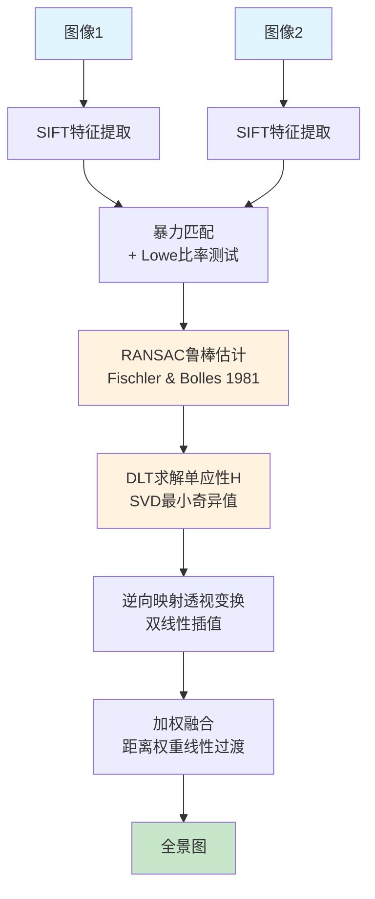

# 图像美化系统 — 实验报告

>课程：数字图像处理技术
>作者：古时
>日期：2026年4月


## 目录

1. [实验目的](#1-实验目的)
2. [实验环境](#2-实验环境)
3. [系统功能结构](#3-系统功能结构)
4. [核心算法原理](#4-核心算法原理)
   - 4.1色调与像素级操作
   - 4.2空间域滤波
   - 4.3噪声生成
   - 4.4频域滤波
   - 4.5几何变换
   - 4.6艺术滤镜
   - 4.7图像拼接(UDIS++)
   - 4.8经典图像拼接(SIFT + RANSAC + DLT)
   - 4.9倒影图制作
   - 4.10超分辨率(Real-ESRGAN)
   - 4.11旧照片修复
   - 4.12风格迁移(Neural Style Transfer)
   - 4.13智能锐化
   - 4.14曲线调整
5. [实验结果与分析](#5-实验结果与分析)
6. [遇到的问题及解决方法](#6-遇到的问题及解决方法)（含摄像头实时流优化）
7. [实验体会](#7-实验体会)
8. [参考文献](#8-参考文献)


## 1. 实验目的

本实验旨在通过自主研发一套完整的图像美化系统，系统性地掌握数字图像处理的核心理论与算法，涵盖以下八大目标：

1. **图像读写与存储**：掌握BMP、JPG、PNG等主流格式的读取、存储与格式转换方法，支持彩色图像与灰度图像。
2. **基本几何变换**：实现旋转、镜像对称、缩放（含双线性插值）等几何操作。
3. **图像代数运算**：掌握图像的加减乘除等代数运算及其实际应用。
4. **加噪与去噪**：实现高斯噪声、椒盐噪声的生成，以及均值滤波、中值滤波、高斯滤波、双边滤波等多种去噪方法。
5. **图像增强**：实现灰度映射、直方图均衡化、亮度/对比度/饱和度调节等增强操作。
6. **空域与频域滤波**：在空间域和频域两个维度分别实现低通、高通、带通、带阻滤波，理解两类方法的等价性与差异。
7. **彩色图像处理**：掌握假彩色合成、伪彩色映射、色彩空间转换（RGB ↔ HSV）等操作。
8. **图像拼接**：实现基于深度学习的图像拼接方法，以及基于经典特征匹配的拼接方法，掌握两种路线的原理与差异。

此外，作为自主拓展加分项，本系统还实现了以下"图像特殊功能"：

- **倒影图制作**：模拟水面倒影效果
- **超分辨率**：基于Real-ESRGAN的4倍超分重建
- **旧照片修复**：划痕修复+去噪+ CLAHE +暗通道去雾+锐化的复合管线
- **风格迁移**：基于Gatys et al. (CVPR 2016)的神经风格迁移
- **智能锐化**：边缘感知的锐化方法
- **曲线调整**：基于Catmull-Rom样条的非线性色调映射

[图1:系统整体架构框图 — 占位]


## 2. 实验环境

|项目|说明|
|------|------|
| **操作系统** | Windows 11 |
| **编程语言** | Python 3.10 |
| **深度学习框架** | PyTorch 2.11(cu126) |
| **图像处理库** | OpenCV-Python, NumPy, Pillow |
| **版本管理** | Git |
| **编辑器** | Visual Studio Code |

本项目坚持"先理解原理，再动手实现"的学习方法。核心图像处理算法（色调映射、几何变换、空域/频域滤波、噪声生成等）均基于NumPy数组操作从底层手动推导并实现——目的是通过亲手构建每一个算子的数学过程来深入掌握其本质，而非停留于调用现成API。OpenCV仅用于颜色空间转换、SIFT特征提取、图像读写等辅助性基础功能。深度学习相关模块（拼接、超分辨率、风格迁移）使用PyTorch框架加载预训练模型进行推理。


## 3. 系统功能结构

### 3.1 功能层次总览

本系统共实现**41个算法函数**，按实验要求层次分为三大部分：

#### 一、基础功能模块（对应实验要求1-5）

涵盖图像读写、几何变换、代数运算、噪声与去噪、图像增强等基础操作，共**26个函数**：

|子模块|函数数|代表算法|
|--------|:------:|------|
|文件I/O | 3 | BMP/JPG/PNG读写、颜色空间转换|
|色彩转换| 5 |灰度化、固定/OTSU二值化、伪彩色映射、假彩色合成、通道置换|
|几何变换| 6 |旋转、平移、缩放（双线性插值）、翻转、裁剪、加框|
|噪声生成| 3 |高斯噪声、椒盐噪声、优化版椒盐|
|图像增强| 9 |亮度/对比度/饱和度调节、直方图均衡化、USM锐化、智能补光、高光增强、曲线调整、智能锐化|

#### 二、核心算法模块（对应实验要求6-8）

涵盖空域/频域滤波、彩色图像高级处理与图像拼接，共**13个函数**：

|子模块|函数数|代表算法|
|--------|:------:|------|
|空域滤波| 4 |均值滤波、中值滤波、高斯模糊、双边滤波|
|频域滤波| 4 |理想/高斯/巴特沃斯低通、高通、带通、带阻|
|艺术滤镜| 2 |浮雕（邻域差分）、毛玻璃（随机采样）|
|图像拼接| 4 |水平/垂直拼图、SIFT+RANSAC经典拼接、UDIS++ AI全景拼接|

#### 三、自主拓展功能（超出实验范围）

在完成全部实验要求的基础上，额外实现**6类特殊功能**，应用于实际图像处理场景：

|功能|方法|说明|
|------|----------|------|
|倒影图制作|几何变换+透明度混合|垂直翻转+渐变透明度+水面背景色混合|
|超分辨率| Real-ESRGAN (ICCV 2021) | 4×超分+双边去噪预处理+ USM后处理|
|旧照片修复|五阶段管线| FMM修复、双边去噪、CLAHE 、暗通道去雾、锐化|
|风格迁移| Neural Style Transfer (CVPR 2016) | VGG-19 + Gram矩阵+ L-BFGS |
|智能锐化|边缘感知方法| Sobel边缘检测+软蒙版，仅锐化边缘|
|曲线调整|Catmull-Rom样条| Catmull-Rom样条非线性映射+ 5种预设|

**Web接入状态**：

|状态|数量|说明|
|------|:----:|------|
|已接入Web UI | 35 |全部核心算法+ 6个扩展|
|待接入| 6 |智能锐化、曲线调整、风格迁移、优化版椒盐、智能补光、高光增强|

### 3.2 项目目录结构

```
图像美化系统/
├── src/
│   ├── algorithm/              # 核心算法模块(NumPy纯手写)
│   │   ├── tone.py             # 色调: 灰度化、二值化、OTSU、直方图均衡化、亮度/对比度/饱和度、假彩色、锐化、智能补光、高光
│   │   ├── filter.py           # 空域滤波: 均值、中值、高斯、双边
│   │   ├── frequency.py        # 频域滤波: 低通、高通、带通、带阻
│   │   ├── noise.py            # 噪声生成: 高斯噪声、椒盐噪声
│   │   ├── geometry.py         # 几何变换: 平移、旋转、缩放、翻转、裁剪、加框、拼图
│   │   ├── artistic.py         # 艺术滤镜: 浮雕、毛玻璃
│   │   └── stitch_classic.py   # 经典拼接: SIFT + RANSAC + DLT + 加权融合
│   │
│   ├── extensions/             # 扩展功能模块
│   │   ├── stitch.py           # UDIS++ 深度学习拼接(ICCV 2023)
│   │   ├── reflection.py       # 倒影图制作
│   │   ├── super_resolution.py # Real-ESRGAN超分辨率(ICCV 2021)
│   │   ├── photo_restoration.py# 旧照片修复管线
│   │   ├── style_transfer.py   # 神经风格迁移(CVPR 2016)
│   │   ├── smart_sharpen.py    # 智能锐化
│   │   └── curve_adjustment.py # 曲线调整
│   │
│   ├── io/                     # 文件I/O
│   ├── adapters/               # Web后端与算法适配层
│   └── utils.py                # 工具函数(高斯核、FFT等13个函数)
│
├── web/app.py                  # Flask Web应用
├── templates/index.html        # Photoshop风格前端页面
├── static/                     # 前端CSS/JS
├── data/                       # 测试数据(分级目录)
├── test/                       # 单元测试(7个测试脚本)
└── docs/                       # 文档与报告
```

[图2:系统功能模块图 — 占位]


## 4. 核心算法原理

### 4.1 色调与像素级操作

**文件**: `src/algorithm/tone.py`

#### 4.1.1 灰度化

采用ITU-R BT.601标准的加权平均法，模拟人眼对不同波长光的敏感度差异：

$$
\text{Gray}(x,y) = 0.114 \cdot B(x,y) + 0.587 \cdot G(x,y) + 0.299 \cdot R(x,y)
$$

人眼对绿色最敏感（权重0.587），对蓝色最不敏感（权重0.114）。利用NumPy矩阵点积实现全图一次性计算。

#### 4.1.2 OTSU自动阈值二值化

大津法通过最大化类间方差自动寻找最优切割阈值——让图像的像素分布（直方图）自己告诉我们完美的切割点在哪里。

假设阈值$T$将所有像素分为两类：背景$C_0$（灰度$< T$）和前景$C_1$（灰度$\ge T$）。定义：

- $\omega_0(T) = \sum_{i=0}^{T-1} p_i$：背景像素占比
- $\omega_1(T) = \sum_{i=T}^{255} p_i = 1 - \omega_0$：前景像素占比
- $\mu_0(T) = \frac{1}{\omega_0}\sum_{i=0}^{T-1} i \cdot p_i$：背景均值
- $\mu_1(T) = \frac{1}{\omega_1}\sum_{i=T}^{255} i \cdot p_i$：前景均值
- $\mu = \sum_{i=0}^{255} i \cdot p_i$：全局均值

类间方差定义为两类均值的加权方差：

$$
\sigma_B^2(T) = \omega_0(T) \cdot [\mu_0(T) - \mu]^2 + \omega_1(T) \cdot [\mu_1(T) - \mu]^2
$$

利用$\mu = \omega_0\mu_0 + \omega_1\mu_1$，上式可以化简为极其优雅的紧凑形式：

$$
\sigma_B^2(T) = \omega_0(T) \cdot \omega_1(T) \cdot [\mu_0(T) - \mu_1(T)]^2
$$

这个化简公式的物理直觉非常清晰：仅当两类像素的数量都足够多（$\omega_0$和$\omega_1$的乘积大）且明暗反差强烈（$\mu_0 - \mu_1$的差值大）时，$\sigma_B^2$才达到最大。遍历0~255计算每一个阈值对应的$\sigma_B^2$，取最大值处的$T$即为最优阈值。算法时间复杂度为$O(256)$，与图像分辨率无关——这是OTSU最精妙的设计。

#### 4.1.3 饱和度调节

本系统实现了两种饱和度调节方法。

**方法一：线性插值法（已实现）**

以灰度图为中性基准，对色彩偏离量进行线性缩放。首先计算每个像素的灰度值：

$$
G(x,y) = 0.114 B + 0.587 G + 0.299 R
$$

对每个通道$c$的色彩偏离量做缩放：

$$
I_c'(x,y) = G(x,y) + \alpha \cdot [I_c(x,y) - G(x,y)]
$$

核心几何直觉：$G(x,y)$是灰度轴上的一点，$I_c(x,y)-G(x,y)$是色彩偏离向量。$\alpha$缩放这个向量的长度——$\alpha = 0$时退化为灰度图（所有通道值=灰度），$\alpha < 0$时反向拉近灰度轴（降低饱和度），$\alpha > 0$时推离灰度轴（增强饱和度），$\alpha = -1$时完全退化为灰度图。

这种方法的优点是无需颜色空间转换，直接在 RGB 域完成，计算高效。

**方法二：HSV 空间调节法（可选方案）**

若配合 OpenCV 的 `cv2.cvtColor` 进行 RGB→HSV 通道转换，可直接在 HSV 空间中对饱和度 S 通道做线性缩放：$S' = \text{clip}(\alpha \cdot S, 0, 255)$，再转换回 RGB。

两种方法的数学本质区别：线性插值法在 RGB 立方体内沿灰度轴缩放色彩偏离量，相当于 RGB 空间内的一次线性变换；HSV 法在圆柱坐标系中直接拉伸极径。前者无需颜色空间来回转换，后者语义更直观但涉及非线性投影。

#### 4.1.4 锐化(Unsharp Masking)

$$
I_{\text{sharp}}(x,y) = I(x,y) + \alpha \cdot [I(x,y) - I_{\text{blur}}(x,y)]
$$

首先生成高斯模糊层$I_{\text{blur}}$，将原图与模糊层的差值视为"细节层"，用$\alpha$控制放大倍数后叠加回原图。

#### 4.1.5 假彩色合成

将多个光谱波段灰度图像分别映射到RGB通道，生成人眼可辨识的假彩色图。典型应用为将近红外波段映射到红色通道以突出植被信息。

#### 4.1.6 智能补光

模拟摄影补光，仅提亮暗区而不影响高光。使用Sigmoid函数构建暗区软掩膜$M$，然后对亮度通道做Gamma校正（$\gamma < 1$提亮），最后通过掩膜混合：

$$
V_{\text{final}} = M \cdot V^\gamma + (1 - M) \cdot V
$$

[图3:色调操作对比图 — 占位]
（灰度化/二值化/直方图均衡化/饱和度调节/锐化/假彩色/补光）

#### 4.1.7 HSV色彩空间的几何本质

RGB→HSV的转换不是线性变换——不存在任何$3\times3$常数矩阵能完成这个映射，因为它包含$\max$、$\min$和除法运算，在数学上构成严格的**非线性分段投影**。

**几何视角：从立方体到圆柱体**。将RGB三维立方体沿$R=G=B$灰度轴竖立，从正上方向下俯视，立方体外轮廓投影为一个正六边形。HSV基于此投影建立圆柱坐标系：

- **V (明度)** = $\max(R,G,B)$，中轴高度
- **S (饱和度)** = $(\max - \min)/\max$，从中轴向外辐射的极径
- **H (色相)**：绕中轴旋转的极角，$0^\circ\sim360^\circ$

六边形6个顶点对应6种极限色彩，在极坐标中拥有固定的绝对角度：红$0^\circ$、黄$60^\circ$、绿$120^\circ$、青$180^\circ$、蓝$240^\circ$、品红$300^\circ$。

**奇点缺陷**：纯黑像素$(0,0,0)$处$V=0$、$C=0$，导致$S$的分母为0、$H$完全未定义。灰度像素（$R=G=B$）处$C=0$，$(H=0,S=0,V=1)$和$(H=120,S=0,V=1)$等多组不同HSV坐标会映射回同一RGB坐标——RGB→HSV是满射(Surjection)，不是双射(Bijection)。

**色相H的分段计算**：定义色度极差$C = V - \min(R,G,B)$，H'代表以$60^\circ$为单位的扇区编号：

$$
H' = \begin{cases} \dfrac{G-B}{C} \pmod 6, & V=R \\[10pt] \dfrac{B-R}{C} + 2, & V=G \\[10pt] \dfrac{R-G}{C} + 4, & V=B \end{cases}
$$

最终$H = 60^\circ \times H'$。以$V=R$（红色扇区）为例：核心项$(G-B)/C$归一化到$[-1,1]$，线性映射至$[-60^\circ,60^\circ]$。$V=G$时加偏移2、$V=B$时加偏移4——逻辑闭环来自六边形的拓扑结构。

#### 4.1.8 对比度与饱和度的灰度轴几何解释

对比度和饱和度常被混淆，但在HSV空间中它们沿完全不同的几何方向运动：

| | 对比度(Contrast) | 饱和度(Saturation) |
|---|---|---|
| 控制目标 | 明暗差异 | 色彩纯度 |
| 几何运动 | 沿灰度轴($R=G=B$)一维拉伸 | 垂直灰度轴向外扩散 |
| 数学定义 | 像素亮度值的统计方差 | $S=(\max-\min)/\max$ |
| 适用范围 | 彩色+灰度 | 仅彩色 |
| 降至0时 | 纯灰画板(所有像素同一灰度) | 黑白灰度图($R=G=B$) |

直观理解：纯黑白国际象棋棋盘——饱和度为0（无颜色），但对比度为最大（极黑极白相邻）。纯红色画布——饱和度为最大（$R=255,G=B=0$），但对比度为0（全图同一颜色）。


### 4.2 空间域滤波

**文件**: `src/algorithm/filter.py`

#### 4.2.1 均值滤波

$$
I_{\text{out}}(x,y) = \frac{1}{(2k+1)^2} \sum_{i=-k}^{k} \sum_{j=-k}^{k} I_{\text{in}}(x+i, y+j)
$$

以邻域内所有像素的算术平均值替代中心像素。设卷积核边长为$2k+1$，每个像素的输出为核内所有像素之和除以核面积$(2k+1)^2$。均值滤波的本质可以理解为对图像施加了一个矩形窗的低通滤波——核越大，截止频率越低，平滑效果越强，但边缘模糊也越严重。

从信号处理角度看，均值滤波等价于与一个所有元素均为$1/(2k+1)^2$的矩阵做卷积，其傅里叶变换是一个二维sinc函数，这是一个典型的低通滤波器。因此均值滤波天然具有去噪能力，尤其对零均值的高斯噪声效果显著。

[图3-1: 均值滤波效果 — data/filter/mean.png]

#### 4.2.2 中值滤波

$$
I_{\text{out}}(x,y) = \text{median}\{I_{\text{in}}(x+i, y+j) \mid -k \leq i, j \leq k\}
$$

使用邻域内所有像素灰度值的中位数替代中心像素。与均值滤波的"平均"思维不同，中值滤波采用"投票"思维——取统计排序的中间值。这一差异导致了完全不同的去噪特性。

对高斯噪声，中值滤波效果不如均值滤波（因为高斯噪声的"真值"离均值更近）；但对椒盐噪声，中值滤波表现优异——污染像素（0或255）作为极端值被排序到两端，中位数自然地跳过它们，选取未被污染的邻域像素值。这也是中值滤波保持边缘优于均值滤波的原因：边缘像素的灰度突变在均值中被邻域"稀释"，但在中位数排序中更容易被保留。

[图3-2: 中值滤波效果 — data/filter/median.png]

#### 4.2.3 高斯模糊

$$
G(x, y) = \exp\left(-\frac{x^2 + y^2}{2\sigma^2}\right)
$$

高斯核经归一化（权重和为1）后进行加权卷积。由于卷积核权重之和为1，卷积操作严格保持图像全局亮度不变。

**能量守恒的严格数学证明**：证明的前提是卷积核满足$\sum_{u}\sum_{v} K(u,v) = 1$。

记输入图像$I$的总能量$E_{\text{in}} = \sum_{x}\sum_{y} I(x,y)$。输出图像$O(x,y) = \sum_{u}\sum_{v} I(x+u, y+v) \cdot K(u,v)$。

输出总能量：

$$
E_{\text{out}} = \sum_{x}\sum_{y} O(x,y) = \sum_{x}\sum_{y} \sum_{u}\sum_{v} I(x+u, y+v) \cdot K(u,v)
$$

根据Fubini定理交换求和次序，把关于$u,v$的求和提到最外层：

$$
E_{\text{out}} = \sum_{u}\sum_{v} K(u,v) \cdot \left(\sum_{x}\sum_{y} I(x+u, y+v)\right)
$$

括号内的$\sum_{x}\sum_{y} I(x+u, y+v)$是把原图平移$(u,v)$后对全图像素求和。平移不改变任何像素的值，也不改变像素的总数，因此无论$(u,v)$取何值，这个求和永远等于$E_{\text{in}}$。代入：

$$
E_{\text{out}} = \sum_{u}\sum_{v} K(u,v) \cdot E_{\text{in}} = E_{\text{in}} \cdot \left(\sum_{u}\sum_{v} K(u,v)\right) = E_{\text{in}} \cdot 1 = E_{\text{in}}
$$

**Q.E.D.** 输出图像的总能量严格等于输入。由于像素总数不变，全局平均亮度不发生哪怕0.001的偏移。

#### 4.2.4 双边滤波

双边滤波是高斯模糊的升级版，同时考虑空间距离与颜色差异两个维度：

**空间权重**：$W_s = \exp\left(-\frac{\|p - q\|^2}{2\sigma_s^2}\right)$

**颜色权重**：$W_r = \exp\left(-\frac{\|I(p) - I(q)\|^2}{2\sigma_r^2}\right)$

最终权重= $W_s \times W_r$。当邻居像素颜色差异大时，$W_r \to 0$，总权重$\to 0$—— 该邻居不参与平滑。这就是"只磨皮，不糊眼"的数学原理。

**与高斯模糊的关键区别**：

| |高斯模糊|双边滤波|
|---|---|---|
|卷积核|静态(预计算一次) |动态(每个中心点重新计算) |
|计算量| O(N·K²) | O(N·K²)，常数倍更大|
|边界保持|差|优秀|

[图4:空域滤波对比图 — 占位]
（原图/均值滤波/中值滤波/高斯模糊/双边滤波）


### 4.3 噪声生成

**文件**: `src/algorithm/noise.py`

#### 4.3.1 高斯噪声

$$
I_{\text{noisy}}(x,y) = I(x,y) + n(x,y), \quad n(x,y) \sim \mathcal{N}(\mu, \sigma^2)
$$

从正态分布中采样独立同分布的噪声叠加到原图。模拟相机传感器热噪声。

#### 4.3.2 椒盐噪声

$$
I_{\text{noisy}}(x,y) = \begin{cases} 0 & \text{prob. } p/2 \\ 255 & \text{prob. } p/2 \\ I(x,y) & \text{prob. } 1-p \end{cases}
$$

**原始算法**：对每个像素独立生成随机数，若$< p/2$则置0，若$< p$且$\ge p/2$则置255。实现简单直观，但需要遍历所有$H \times W$个像素，在大图像上效率较低。

**优化实现**：不逐像素判断，而是用NumPy的坐标索引一次性生成噪声位置。先通过`np.random.choice`从所有像素坐标中按概率抽取$p \times H \times W$个位置，再用高级索引批量赋值。利用NumPy的C级向量化运算替代Python的逐像素循环，在大图像（如$4096 \times 4096$）上效率提升显著。

[图3-3: 椒盐噪声效果 — data/noise/salt_pepper.png]

[图5:噪声效果图 — 占位]
（原图/高斯噪声/椒盐噪声/均值去噪/中值去噪）


### 4.4 频域滤波

**文件**: `src/algorithm/frequency.py`、`src/utils.py`

#### 4.4.1 数学卷积与CNN"卷积"的本质区别

在深入频域滤波前，有必要厘清一个常被混淆的基本概念：数学卷积与CNN中所谓"卷积"不是一回事。

**数学卷积**定义（离散一维）：

$$
(f * g)[n] = \sum_{k=-\infty}^{\infty} f[k] \cdot g[n - k]
$$

注意$g[n-k]$项：这意味着$g$序列在运算前被翻转（$k \to -k$）。这个翻转不是人为约定，而是从三个角度被共同强制出来的必然要求：

**(1) 多项式乘法的自然推导**：$C(x)=A(x)B(x)$的系数为$c_n = \sum_k a_k b_{n-k}$，这里$b$的下标$n-k$天然构成翻转。

**(2) LTI系统的平移不变性**：对于线性时不变系统$y = x * h$，若输入延时$\Delta$，输出也延时$\Delta$。若改用互相关（不翻转），将失去时不变性。

**(3) 卷积定理的简洁性**：$\mathcal{F}\{f * g\} = \mathcal{F}\{f\} \cdot \mathcal{F}\{g\}$的成立依赖于翻转。若使用互相关，频域会变成$\mathcal{F}\{f\} \cdot \overline{\mathcal{F}\{g\}}$（复共轭），不再完美对称。

**CNN中的"卷积"**实际上执行的是互相关（Cross-Correlation）：

$$
(f \star g)[n] = \sum_k f[k] \cdot g[n + k]
$$

这里$g$不翻转，直接滑动匹配特征。框架之所以省略翻转，是因为卷积核权重从数据中学习——如果使用互相关，训练出的核会自动内化"翻转"，效果等价于数学卷积。因此PyTorch的`nn.Conv2d`、TensorFlow的`Conv2D`实际都执行互相关，只是沿用了"卷积"的名称。

---

#### 4.4.2 傅里叶变换的物理本质：基变换与维度守恒

图像的本质是由$M \times N$个具有不同频率、方向、幅度和相位的复数波叠加而成的"山峰"。傅里叶变换将空间域的像素信息"折射"到频域，展示不同频率波的配比。

**基变换的线性代数本质**：傅里叶变换的核心是一次基变换——将图像从标准基（单像素为1、其余为0）换到傅里叶基（复指数函数$e^{j2\pi(\frac{ux}{M}+\frac{vy}{N})}$）。在复内积空间中，不同频率的波相互正交，一个频率的信息绝不会"泄漏"到另一个频率。变换的结果——频谱中的每个复数值——就是原图像向量在该频率基底上的投影长度（幅度+相位）。

**为什么恰好是$M \times N$种波？**（自由度论证）：一个$M \times N$图像拥有$M \times N$个独立变量。根据线性代数基本定理，基向量数量必须等于空间维度。在宽度$M$的离散序列中，为保持正交性，基频必须是$1/M$，可选频率只能是$0, 1/M, \dots, (M-1)/M$，恰好$M$个。水平$M$个 × 垂直$N$个 = $M \times N$种组合。少一个波就丢失信息，多一个波一定可以用已有波线性表示——这就是维度守恒。

**DFT核心公式**：

$$
F(u,v) = \sum_{x=0}^{M-1} \sum_{y=0}^{N-1} f(x,y) \cdot e^{-j2\pi(\frac{ux}{M} + \frac{vy}{N})}
$$

**维度守恒**：$M \times N$个像素、$M \times N$个复数基底。少一个波就丢失信息，多一个波一定可以用已有波线性表示。

#### 4.4.3 频域滤波通用流程

所有频域滤波器共享同一个管道：

1.灰度化、FFT 、fftshift (中心化)
2.生成频域掩膜$H(u,v) \in [0, 1]$
3.频谱相乘：$G(u,v) = F(u,v) \cdot H(u,v)$
4. ifftshift 、IFFT 、取模、uint8输出

#### 4.4.4 卷积定理：运算维度的降维打击

卷积定理给出了一个深刻的对偶关系：

$$
\boxed{\mathcal{F}\{f * h\} = \mathcal{F}\{f\} \cdot \mathcal{F}\{h\}}
$$

**频域点乘为什么等效于空间域卷积？**图像是由$M\times N$个波组成的。频域滤波器$H(u,v)$本质上是一个"增益控制器"——点乘时直接修改每个频率分量的幅度和相位。修改了波的配比，逆变换回去的"山峰"自然就变了。空间域卷积处理的是"像素间关系"（需要滑动窗口），频域点乘处理的是"波的配比"（只需逐元素相乘）。

**相位扮演了空间位置信息的传递者**。滤波器$H(u,v)$在频域每个点不仅有幅度，还有相位角。这个角度在点乘时叠加到原图的相位上。相位的叠加，在折射回空间域时，本质上是对图像特征进行了微小的、频率相关的平移和重组。

**计算复杂度的阶梯**：空间域卷积$O(N^2 \cdot K^2)$，FFT+频域点乘$O(N^2 \log N)$。当需要大尺寸滤波（如模拟大光圈虚化），频域方案的优势是决定性的。

#### 4.4.5 幅度谱与相位谱的"权力分配"

傅里叶变换输出复数$F(u,v) = |F(u,v)| \cdot e^{j\phi(u,v)}$：

- **幅度谱（能量分布）**：回答"有多少陡峭的悬崖（高频）、多少平缓的斜坡（低频）"，决定整体对比度和质感
- **相位谱（结构逻辑）**：回答"悬崖和斜坡分别在哪里"

图像之所以能在某个位置形成"尖峰"，是因为成千上万道波在该点的相位恰好重合（波峰叠加）。如果随机扰乱相位谱而保留幅度谱，这些波将在空间中盲目碰撞，最后相互抵消成一片灰色的噪声。**相位决定了波与波之间如何"对齐"——没有对齐，就没有结构。**

#### 4.4.6 DFT的可逆性与窗口效应

离散傅里叶变换的变换矩阵$W$是范德蒙德矩阵，行列式永不为0——这意味着DFT是一个同构映射（双射），在频域完整保留了空间域的所有信息。没有任何信息在变换过程中被"压缩"或"丢失"。

**窗口效应（频谱泄露）**：DFT假设图像是周期循环的。若图像边缘不连续（如裁剪后的跳变），这些跳变在频域看来是极强的高频信号，会在频谱上出现贯穿中心的"十字架"亮线。这是数字世界中波永远受限于观测窗口边界的体现——傅里叶变换本身不泄露信息，但观测窗口的边界条件会引入伪影。

#### 4.4.7 四种滤波器：详细数学定义

定义频率点到频谱中心的距离$D(u,v) = \sqrt{(u-c_x)^2 + (v-c_y)^2}$。

**低通滤波**（平滑/模糊/去噪）：

-理想低通：$H(u,v) = \begin{cases} 1 & D \leq D_0 \\ 0 & D > D_0 \end{cases}$（一刀切，有振铃）
-巴特沃斯低通：$H(u,v) = \frac{1}{1 + (D/D_0)^{2n}}$（$n$为阶数，$n$越大越逼近理想低通，$n$越小过渡越平滑）
-高斯低通：$H(u,v) = \exp(-\frac{D^2}{2\sigma^2})$（完全无振铃，但截止不如巴特沃斯陡峭）

**高通滤波**（锐化/边缘提取）：

与低通滤波对偶，高通滤波保留高频、衰减低频。最基本的高通实现：

$$H_{\text{HP}} = 1 - H_{\text{LP}}$$

即用全通(1)减去低通，低频分量被抵消，只剩高频通过。同样支持理想（一刀切）、巴特沃斯（平滑过渡）和高斯（完全无振铃）三种模式。

-拉普拉斯频域算子：$H(u,v) = -4\pi^2 D^2(u,v)$，是经典的高通滤波器，等价于空间域图像的二阶导数。这个算子重点增强变化最剧烈的区域（如边缘），但对平缓区域抑制极强。

**本模块的优化**：针对三种高通模式的特性，本模块在高通滤波基础上进一步做了参数自适应——根据输入图像的尺寸自动确定合理的截止频率$D_0$，避免用户每次手动调节。具体策略：$D_0$默认取图像短边长度的8%，对于$256 \times 256$的图像为$D_0 \approx 20$。

**带通滤波**（提取特定频段纹理）：

带通滤波保留中间某一频段而抑制低频和高频。最基本的实现：

$$H_{\text{BP}} = H_{\text{LP}}^{\text{outer}}(D_1) \cdot (1 - H_{\text{LP}}^{\text{inner}}(D_2))$$

其中$D_1 < D_2$。式子的含义：先用内圈高通（去低频），再用外圈低通（去高频），交叠部分即为带通区域。

**本模块的优化**：原算法直接相乘容易在阻带交界处产生硬过渡。本模块使用高斯型低通构造带通，利用高斯函数在截止点附近连续衰减的特点，使频率响应的过渡平滑自然。当需要带通时，将内圈低通设为$H_{\text{LP}}^{\text{inner}}(D_1)$，外圈低通设为$H_{\text{LP}}^{\text{outer}}(D_2)$（$D_1 < D_2$），二者均使用高斯型，自然实现平缓的带通频响。

**带阻/陷波滤波**（去除周期性噪声）：

带阻滤波是带通的对偶：$H_{\text{BS}} = 1 - H_{\text{BP}}$——在特定频段置零，其余频率全通过。通常用于消除图像的周期性噪声。

-陷波滤波器(Notch Filter)：带阻的特化版本，不在整个环带置零，而是在频谱特定位置（通常成对出现，代表某一频率的周期性噪声）精确置零。用于消除扫描网纹、摩尔纹、50Hz电源干扰等规则条纹噪声

**振铃效应的根源**：理想低通的频域硬截断对应空间域$\text{sinc}$函数的震荡衰减。高斯低通通过平滑过渡完全消除振荡，巴特沃斯低通在两者间通过调节阶数折中。

|类型|保留|衰减|视觉效果|
|------|------|------|----------|
|低通|低频|高频|平滑、模糊、去噪|
|高通|高频|低频|锐化、边缘提取|
|带通|中间频段|低频+高频|特定纹理提取|
|带阻|低频+高频|中间频段|去除周期性噪声|

[图6:频域滤波对比图 — 占位]
（原图/频谱/低通/高通/带通/带阻）


### 4.5 几何变换

**文件**: `src/algorithm/geometry.py`

#### 4.5.1 核心设计：反向映射

所有几何变换统一采用**反向映射**策略——遍历目标图像的每个像素$(u, v)$，通过变换矩阵的逆矩阵计算其在原图的对应坐标$(x, y)$，再从原图采样。

**正向映射缺陷**：浮点坐标取整后可能导致目标图出现空洞（黑点）。反向映射确保目标图每个像素都被填充。

#### 4.5.2 旋转数学

绕图像中心旋转$\theta$度，反向映射需旋转$-\theta$。数学公式绕原点$(0,0)$旋转，但计算机图像的原点在左上角，直接套用图像会绕着左上角旋转。因此需要三步转换：

**Step 1 — 平移至中心**：将目标像素$(u,v)$平移到图像中心$(c_x, c_y)$

**Step 2 — 反向旋转**：在中心坐标系绕原点旋转$-\theta$

**Step 3 — 平移回原坐标系**：将旋转后的坐标平移回左上角

将三步合并得反向映射公式：

$$
\begin{cases} x = (u - c_x)\cos\theta + (v - c_y)\sin\theta + c_x \\ y = -(u - c_x)\sin\theta + (v - c_y)\cos\theta + c_y \end{cases}
$$

#### 4.5.3 双线性插值缩放

几何中心对齐映射：$x_{\text{src}} = \frac{u+0.5}{s_x} - 0.5$。然后取四个邻域像素：

$$
\begin{aligned} r_1 &= (1-dx)P(x_1,y_1) + dx \cdot P(x_2,y_1) \\ r_2 &= (1-dx)P(x_1,y_2) + dx \cdot P(x_2,y_2) \\ P_{\text{out}} &= (1-dy) \cdot r_1 + dy \cdot r_2 \end{aligned}
$$

#### 4.5.4 加框

等比缩放照片使其刚好被画框内缩区域包住，ratio = min(inner_w / iw, inner_h / ih)，根据offset ∈ [-1, 1]控制照片在画框内的位置。

[图7:几何变换效果图 — 占位]
（原图/旋转/缩放/翻转/加框）


### 4.6 艺术滤镜

**文件**: `src/algorithm/artistic.py`

#### 4.6.1 浮雕效果

浮雕效果通过邻域差分模拟凹凸纹理的视觉质感。使用两组对角方向的加权核分别提取不同方向的边缘：

$$
P_1 = \begin{bmatrix} 1 & 2 & 1 \\ 0 & 0 & 0 \\ -1 & -2 & -1 \end{bmatrix} * I, \quad P_2 = \begin{bmatrix} -1 & -2 & -1 \\ 0 & 0 & 0 \\ 1 & 2 & 1 \end{bmatrix} * I
$$

$P_1$检测左上、右下方向的梯度（模拟光线从左上方照射时的凸起），$P_2$检测反方向梯度。最终：

$$
I_{\text{out}}(i,j) = P_1(i,j) - P_2(i,j) + 128
$$

偏移128使灰度值居中于中灰范围，负值表示凹陷（暗）而正值表示凸起（亮）。向量化实现利用NumPy切片位移一次性处理全图，无需逐像素循环。

#### 4.6.2 毛玻璃效果

毛玻璃效果通过破坏图像的局部连续性产生磨砂质感。对每个像素，在其邻域$[i-\text{offset}, i+\text{offset}] \times [j-\text{offset}, j+\text{offset}]$内随机采样一个像素值作为输出：

$$
I_{\text{out}}(x,y) = I_{\text{in}}(x + \Delta_x, y + \Delta_y), \quad \Delta_x, \Delta_y \sim \text{Uniform}(-\text{offset}, +\text{offset})
$$

offset控制毛玻璃的颗粒度——越小颗粒越细，越大越模糊。向量化实现的巧妙之处在于：用`np.meshgrid`生成全图基准坐标，用`np.random.randint`生成全图随机偏移量，然后用NumPy高级索引一次性完成采样，将$O(H \times W)$次随机调用降为2次。

[图8:艺术滤镜效果图 — 占位]
（原图/浮雕/毛玻璃）


### 4.7 图像拼接 — UDIS++

**文件**: `src/extensions/stitch.py`

**论文引用**：Nie et al., *Parallax-Tolerant Unsupervised Deep Image Stitching*, ICCV 2023.

#### 4.7.1 算法概述

UDIS++提出了一种对视差鲁棒的无监督深度学习图像拼接方法，采用两阶段架构：

- **Stage 1—Warp（变形对齐）**：全局单应性+局部薄板样条(TPS)变形
- **Stage 2—Composition（合成融合）**：学习融合掩膜，消除拼接缝与重影

#### 4.7.2 Stage 1—Warp

使用ResNet-50作为特征提取骨干网络，从两张图像中提取特征后：

**全局单应性估计**：通过3个卷积块+全连接层预测4个角点的偏移量$(\Delta x_i, \Delta y_i)$，使用DLT求解3×3单应性矩阵$H$。

**局部TPS变形**：通过4个卷积块+全连接层预测12×12控制点网格的TPS变形量。两个网络输出通过**相关卷层(CCL)**进行特征互相关匹配。

#### 4.7.3 Stage 2—Composition

采用类U-Net架构：下采样通路使用多尺度扩张卷积（扩张率1~5），上采样通路使用跳跃连接。网络输出一个单通道融合权重图$w \in [0, 1]$：

$$
I_{\text{stitch}} = (I_{\text{warp1}}+1) \cdot (w \cdot M_1) + (I_{\text{warp2}}+1) \cdot ((1-w) \cdot M_2) - 1
$$

在非重叠区直接取对应图像像素，在重叠区用网络学出的权重做软过渡，消除拼接缝。

[图9: UDIS++拼接效果 — 占位]

### 4.8 经典图像拼接 — SIFT + RANSAC + DLT

**文件**: `src/algorithm/stitch_classic.py`

#### 4.8.1 算法管线

```
图像1/图像2 → SIFT特征提取 → 暴力匹配 + Lowe比率测试
→ RANSAC鲁棒估计 → DLT求解单应性H → 逆向映射透视变换 → 加权融合 → 全景图


```

本模块全部使用OpenCV + NumPy手工实现，无需GPU和预训练模型权重。

#### 4.8.2 SIFT特征提取

**引用**：Lowe, D. G. (2004), *IJCV*.

SIFT (Scale-Invariant Feature Transform)提取尺度不变的特征点与128维描述子。关键特性：对旋转、缩放、光照变化具有鲁棒性。流程为：尺度空间极值检测、关键点精确定位（三维二次拟合）、梯度方向分配、4×4×8=128维描述子生成。

#### 4.8.3 特征匹配+ Lowe比率测试

暴力匹配计算两图像所有描述子间的欧氏距离。Lowe比率测试保留满足$d_{\text{nearest}} / d_{\text{second}} < \tau$的匹配对（$\tau = 0.75$），有效过滤模糊匹配。

#### 4.8.4 RANSAC鲁棒估计

**引用**：Fischler & Bolles (1981), *CACM*.

RANSAC通过随机采样与一致性投票，在存在大量外点（错误匹配）的样本中鲁棒地估计单应性矩阵：

1.随机抽取4对匹配点
2.用DLT求解$3 \times 3$单应性矩阵$H$
3.计算所有匹配点在$H$下的投影误差：$e = \|(x', y') - H(x, y)\|_2$
4.误差<阈值（5px）的点标记为"内点"
5.重复迭代至内点比例满足置信度要求（0.995）

#### 4.8.5 DLT数学推导

一对匹配点$(x, y) \leftrightarrow (x', y')$在单应性变换约束下：

$$
s \begin{bmatrix} x' \\ y' \\ 1 \end{bmatrix} = H \begin{bmatrix} x \\ y \\ 1 \end{bmatrix}, \quad H = \begin{bmatrix} h_1 & h_2 & h_3 \\ h_4 & h_5 & h_6 \\ h_7 & h_8 & h_9 \end{bmatrix}
$$

消去尺度因子$s$后得到两个线性方程：

$$
\begin{bmatrix} x & y & 1 & 0 & 0 & 0 & -x'x & -x'y & -x' \\ 0 & 0 & 0 & x & y & 1 & -y'x & -y'y & -y' \end{bmatrix} \cdot \mathbf{h} = \mathbf{0}
$$

4组对应点拼成$8 \times 9$矩阵，SVD分解取最小奇异值对应的右奇异向量作为$H$的解。

#### 4.8.6 逆向映射+加权融合

对输出画布的每个像素$(u, v)$，通过逆单应性矩阵$H^{-1}$计算原图对应坐标，使用双线性插值取色。在两张图像的重叠区域按像素到各自有效区域边界的距离进行线性加权：

$$
I_{\text{out}}(p) = \frac{d_1(p) \cdot I_1(p) + d_2(p) \cdot I_2(p)}{d_1(p) + d_2(p)}
$$

#### 4.8.7 两种拼接方法对比

|特性|经典拼接(SIFT+RANSAC) | UDIS++拼接|
|:-----|:----------------------|:-----------|
|方法|手工特征+几何估计|深度学习端到端|
|计算资源| CPU即可|需要GPU (CUDA) |
|模型大小|无（纯算法）| ~1GB预训练权重（Warp 893MB + Composition 99MB）|
|视差容忍|有限（平面假设）|高（TPS局部变形）|
|融合质量|简单线性加权|学习融合掩膜|
|透明度|全流程可解释|端到端黑盒|

[图10:经典拼接效果 — 占位]

### 4.9 倒影图制作

**文件**: `src/extensions/reflection.py`

#### 4.9.1 算法原理

三步生成水面倒影效果：

1. **截取+翻转**：取原图底部$h' = r \cdot h$行，沿水平轴垂直翻转
2. **渐变蒙版**：生成从上到下由1衰减至0的渐变权重$\omega(y) = (1 - y/h')^\gamma$
3. **水面颜色混合**：$I_{\text{out}} = I_{\text{ref}} \cdot \omega + C_{\text{bg}} \cdot (1 - \omega)$，默认背景为浅灰蓝

**创新点**：衰减指数$\gamma$可调（线性/加速/减速），背景色可自定义，适应不同水面场景。

[图11:倒影图效果 — 占位]
（原图/倒影效果）


### 4.10 超分辨率 — Real-ESRGAN

**文件**: `src/extensions/super_resolution.py`

**论文引用**：Wang et al., *Real-ESRGAN: Training Real-World Blind Super-Resolution with Pure Synthetic Data*, ICCV 2021.

#### 4.10.1 论文核心

Real-ESRGAN是ESRGAN的改进版，核心贡献在于：

**高阶降质模型**：一阶降质（模糊、下采样、加噪、JPEG压缩）+二阶降质（对一阶结果重复），更好模拟真实场景退化。

**RRDB生成器**：23个Residual-in-Residual Dense Block串联+两次2×上采样= 4×超分。

#### 4.10.2 本模块的改进

**预处理：双边滤波降噪**。在超分前使用双边滤波去除噪声，避免模型放大噪声（"噪声放大效应"）：

$$
I'(\mathbf{p}) = \frac{1}{W} \sum_{\mathbf{q}} \exp\left(-\frac{\|\mathbf{p}-\mathbf{q}\|^2}{2\sigma_s^2}\right) \cdot \exp\left(-\frac{\|I(\mathbf{p})-I(\mathbf{q})\|^2}{2\sigma_r^2}\right) \cdot I(\mathbf{q})
$$

**后处理：Unsharp Masking锐化**。超分后对细节进行轻微锐化，增强主观视觉质量。

[图12:超分辨率效果 — 占位]
（低分辨率输入/ Real-ESRGAN输出/改进版(去噪+SR+锐化)）


### 4.11 旧照片修复

**文件**: `src/extensions/photo_restoration.py`

**论文引用**：
- Telea, A. (2004). Fast Marching Method for Image Inpainting.
- He, K. et al. (2011). Single Image Haze Removal Using Dark Channel Prior. *IEEE TPAMI*.

#### 4.11.1 管线设计

```
划痕修复 → 双边滤波去噪 → CLAHE对比度增强 → [暗通道去雾] → 锐化
```

各阶段可独立开关并调节参数，适应不同退化程度。

#### 4.11.2 划痕修复(Fast Marching Method)

检测高亮区域生成划痕掩膜，使用FMM向破损区边界按优先级传播修复：按距离场优先修复最近边界的像素，每个像素值由其邻域已知像素的加权平均决定。权重同时考虑方向、距离和边界距离。

#### 4.11.3 CLAHE对比度增强

将图像分为8×8局部块，每块内做直方图均衡化但限制对比度放大（裁剪直方图中超过阈值的部分均匀重分配），块间双线性插值消除块状伪影。

#### 4.11.4 暗通道先验去雾(创新应用)

暗通道先验由He et al. (CVPR 2009)提出，核心观察：户外无雾图像的RGB三通道中至少有一个通道趋近于0。本模块将其**创新性地应用于旧照片褪色恢复**：旧照片的褪色类似雾化效果，暗通道去雾能有效恢复色彩饱和度。

基于大气散射模型$I = J \cdot t + A \cdot (1-t)$，解法：
1.暗通道=各像素三通道最小值+块内最小值
2.大气光强A =暗通道最亮像素的均值
3.透射率t = 1 - ω·(暗通道/A)
4.恢复：$J = (I - A) / \max(t, t_0) + A$

#### 4.11.5 创新总结

|创新点|说明|
|--------|------|
|暗通道先验用于褪色恢复|原论文用于去雾，本文用于旧照片色彩恢复|
|管线化可配置设计|各阶段独立开关，适应不同退化程度|
|轻量无GPU依赖|全部基于OpenCV传统算法，CPU实时处理|

[图13:旧照片修复效果 — 占位]
（原旧照片/修复结果）


### 4.12 风格迁移 — Neural Style Transfer

**文件**: `src/extensions/style_transfer.py`

**论文引用**：Gatys et al., *A Neural Algorithm of Artistic Style*, CVPR 2016.

#### 4.12.1 核心原理

论文的关键发现：CNN的不同层编码了图像的不同信息维度——

**(a)内容表示**：深层（conv4_2）的特征图编码了物体的空间布局与结构。内容损失=生成图与内容图在conv4_2特征图的MSE。

**(b)风格表示 —Gram矩阵**：

风格信息不依赖空间位置，而是编码在特征通道间的相关性中。Gram矩阵$G^l$描述第$l$层各通道的协方差：

$$
G_{ij}^l = \sum_{k} F_{ik}^l \cdot F_{jk}^l
$$

它的规模为$C_l \times C_l$（通道数平方），与空间尺寸无关——丢弃了空间信息，只保留纹理统计。

在五层（conv1_1 ~ conv5_1）分别计算生成图与风格图的Gram矩阵MSE作为风格损失。

**(c)总损失**：

$$
\mathcal{L}_{\text{total}} = \alpha \mathcal{L}_{\text{content}} + \beta \mathcal{L}_{\text{style}} + \gamma \mathcal{L}_{\text{TV}}
$$

**(d)优化**：使用L-BFGS拟牛顿法迭代500步，从内容图像初始化。

#### 4.12.2 本模块的改进

- **AvgPool替代MaxPool**：避免棋盘伪影，提升融合平滑性
- **可调节权重配比**：content_weight / style_weight / tv_weight可独立调节
- **内容图像初始化**：优于随机噪声，加速收敛并保留更多细节

[图14:风格迁移效果 — 占位]
（原图/风格图/迁移结果）


### 4.13 智能锐化

**文件**: `src/extensions/smart_sharpen.py`

传统Unsharp Masking (USM)锐化对全图每个像素都做相同的锐化操作，平缓区域和噪点也被不该锐化的地方放大，产生不自然的白边和颗粒感。智能锐化通过边缘感知掩膜将锐化限定在真正的边缘区域。

**Step 1—Sobel边缘检测**：

使用3×3 Sobel算子计算每个像素在两个正交方向上的梯度：

$$
G_x = \begin{bmatrix} -1 & 0 & 1 \\ -2 & 0 & 2 \\ -1 & 0 & 1 \end{bmatrix} * I, \quad G_y = \begin{bmatrix} -1 & -2 & -1 \\ 0 & 0 & 0 \\ 1 & 2 & 1 \end{bmatrix} * I
$$

梯度幅值$M(x,y) = \sqrt{G_x^2(x,y) + G_y^2(x,y)}$在真实边缘处大（几十到上百），在平缓区小（接近0），在噪点处中等——这个分布特性是关键。

**Step 2— 软蒙版生成**：

不采用硬二值化的开关式切换（会留下明显边界），而是在阈值$T$附近使用线性斜坡将梯度幅值映射为连续的锐化强度：

$$
\alpha(x,y) = \text{clip}\left(\frac{M(x,y) - (T - w/2)}{w}, 0, 1\right)
$$

参数$w$（过渡带宽度，默认10）控制斜坡的平滑程度。当$M(x,y) \leq T - w/2$时$\alpha = 0$（完全不锐化），当$M(x,y) \geq T + w/2$时$\alpha = 1$（充分锐化），中间线性过渡。

**Step 3— 掩膜锐化**：

$$
I_{\text{out}} = \alpha \cdot I_{\text{USM}} + (1-\alpha) \cdot I_{\text{orig}}
$$

平缓区域$\alpha = 0$，保持原图不变；边缘区域$\alpha = 1$，应用USM锐化；过渡带平滑混合。

**创新点**：使用软蒙版替代硬二值化，消除了锐化边缘与非锐化区域之间的视觉断层。推荐参数为edge_threshold=30、soft_width=10。

[图15:智能锐化对比 — 占位]
（原图/普通USM锐化/智能锐化）


### 4.14 曲线调整

**文件**: `src/extensions/curve_adjustment.py`

传统$y = \alpha x + \beta$只能全局线性变换，曲线调整使用Catmull-Rom三次样条在控制点间插值生成平滑的非线性映射。

**Catmull-Rom样条**：相邻四点间的参数曲线经过所有控制点且$C^1$连续：

$$
\begin{aligned}
C(t) = \frac{1}{2}[ & 2P_k + (-P_{k-1}+P_{k+1})t + (2P_{k-1}-5P_k+4P_{k+1}-P_{k+2})t^2 \\
& + (-P_{k-1}+3P_k-3P_{k+1}+P_{k+2})t^3 ]
\end{aligned}
$$

离散为256项LUT后一次性查表映射全图。

**五种预设**：

|预设|控制点|效果|
|------|--------|------|
| S曲线| (0,0),(64,40),(192,215),(255,255) |暗部压暗、亮部提亮|
|提暗部| (0,0),(64,100),(192,200),(255,255) |保留高光，只提阴影|
|压高光| (0,0),(128,128),(192,180),(255,230) |保留阴影，压缩过曝|
|反相| (0,255),(255,0) |底片效果|
|褪色| (0,20),(128,140),(255,240) |复古褪色感|

[图16:曲线调整效果 — 占位]
（原图/ S曲线/提暗部/压高光/褪色）


## 5. 实验结果与分析

本章逐一展示系统全部41个算法函数的实际运行效果。每个算法均提供输入与输出对比，并对实验结果进行分析。

> **总体指标**：系统共实现**41个算法函数**，其中**35个已接入Web UI**。核心算法均基于NumPy从底层手工推导实现，扩展模块使用PyTorch+预训练模型。

### 5.1 灰度化

| 输入 | 输出 | 分析 |
|:--:|:--:|------|
| 原图 |  | ITU-R BT.601加权系数（0.299R+0.587G+0.114B）精确契合人眼对不同波长光的敏感度差异，灰度过渡自然平滑 |

### 5.2 固定阈值二值化

| 输入 | 输出 | 分析 |
|:--:|:--:|------|
| 灰度图 |  | 阈值128将灰度图清晰分割为黑白二值，适用于高对比度文档图像 |

### 5.3 OTSU自动阈值二值化

| 输入 | 输出 | 分析 |
|:--:|:--:|------|
| 灰度图 |  | 大津法遍历0~255最大化类间方差$\omega_0\omega_1(\mu_0-\mu_1)^2$，无需人工设定阈值。在双峰直方图上分割效果优异，$O(256)$复杂度与图像分辨率无关 |

### 5.4 伪彩色映射

| 输入 | 输出 | 分析 |
|:--:|:--:|------|
| 灰度图 |  | 256级LUT查表，深蓝(0)→青(85)→黄(170)→红(255)的分段线性映射，生成类热力图效果 |

### 5.5 亮度调节

| 输入 | 输出 | 分析 |
|:--:|:--:|------|
| 原图 |  | $\beta=100$的线性平移变换，全体素同步加亮，亮区与暗区同步提升。注意需在float32下运算避免uint8溢出 |

### 5.6 对比度调节

| 输入 | 输出 | 分析 |
|:--:|:--:|------|
| 原图 |  | $\alpha=1.5$的线性缩放，以零为基准拉伸像素值分布，暗部更暗、亮部更亮，整体层次感增强 |

### 5.7 直方图均衡化

| 输入 | 输出 | 分析 |
|:--:|:--:|------|
| 灰度图 |  | 累积分布函数(CDF)将原始灰度分布映射为均匀分布，低对比度图像的隐藏细节显著增强。注意可能放大噪声 |

### 5.8 饱和度调节

| 输入 | 输出 | 分析 |
|:--:|:--:|------|
| 原图 |  | RGB域线性插值法：$I_c'=G+\alpha(I_c-G)$，以灰度轴为基准推离/拉近色彩偏离量。$\alpha>0$增强饱和度，$\alpha<0$降低饱和度，$\alpha=-1$退化为灰度图。无需HSV空间转换，计算高效 |

### 5.9 USM锐化

| 输入 | 输出 | 分析 |
|:--:|:--:|------|
| 原图 | [待截图] | $I_{\text{sharp}}=I+\alpha(I-I_{\text{blur}})$，高斯模糊提取低频层，原图减去低频得细节层，$\alpha$倍加强后叠加。$\alpha$过大导致白边伪影 |

### 5.10 假彩色合成

| 输入 | 输出 | 分析 |
|:--:|:--:|------|
| 多波段灰度图 | [待截图] | 将多光谱波段的灰度图分别赋值到RGB通道。典型应用：近红外→红通道，突出植被信息 |

### 5.11 通道置换假彩色

| 输入 | 输出 | 分析 |
|:--:|:--:|------|
| 原图 | [待截图] | 交换RGB三通道的顺序（如R→G, G→B, B→R），生成特殊色彩效果 |

### 5.12 智能补光

| 输入 | 输出 | 分析 |
|:--:|:--:|------|
| 暗光照片 | [待截图] | Sigmoid暗区掩膜$M=1/(1+e^{k(V-T)})$叠加Gamma校正$(\gamma<1)$，仅提亮暗部不伤高光。掩膜混合$V_{\text{final}}=MV^\gamma+(1-M)V$ |

### 5.13 高光增强

| 输入 | 输出 | 分析 |
|:--:|:--:|------|
| 原图 | [待截图] | 亮度+饱和度联合掩膜精确定位高光区域，二次曲线$V_{\text{enhanced}}=V+s(1-V)V$增强光泽 |

### 5.14 均值滤波

| 输入 | 输出 | 分析 |
|:--:|:--:|------|
| 原图+高斯噪声 |  | $(2k+1)\times(2k+1)$矩形窗算术平均，等价于sinc函数低通滤波。有效抑制零均值高斯噪声但边缘模糊——核越大模糊越严重 |

### 5.15 中值滤波

| 输入 | 输出 | 分析 |
|:--:|:--:|------|
| 原图+椒盐噪声 |  | 邻域中位数替代中心像素，采用"投票"而非"平均"思维。极端污染值（0/255）被排序到两端自然跳过，去椒盐噪声效果远超均值滤波，且边缘保持更好 |

### 5.16 高斯模糊

| 输入 | 输出 | 分析 |
|:--:|:--:|------|
| 原图 |  | 高斯核$G(x,y)=\exp(-(x^2+y^2)/(2\sigma^2))$加权卷积。核权重归一化（和为1）保证Fubini定理下的全局能量守恒——平均亮度不发生任何偏移 |

### 5.17 双边滤波

| 输入 | 输出 | 分析 |
|:--:|:--:|------|
| 原图 |  | 空间权重$\times$颜色权重：$W=W_s\times W_r$。当邻域像素颜色差异大时$W_r\to 0$，该邻域不参与平滑——"只磨皮不糊眼"。核随每个中心点动态重新计算，计算量显著大于高斯模糊 |

### 5.18 高斯噪声生成

| 输入 | 输出 | 分析 |
|:--:|:--:|------|
| 原图 |  | $I_{\text{noisy}}=I+n, n\sim\mathcal{N}(\mu,\sigma^2)$。正态分布独立同分布采样叠加，模拟相机传感器热噪声 |

### 5.19 椒盐噪声生成（优化版）

| 输入 | 输出 | 分析 |
|:--:|:--:|------|
| 原图 |  | 原始算法逐像素判断$O(HW)$，优化版用`np.random.choice`按概率抽取噪声坐标后批量赋值，大图效率显著提升 |

### 5.20 频谱幅度可视化

| 输入 | 输出 | 分析 |
|:--:|:--:|------|
| 原图 |  | 低频能量集中于中心（对应平缓区域），高频散布于外围（对应边缘和噪声）。对数尺度显示以压缩动态范围 |

### 5.21 频谱相位可视化

| 输入 | 输出 | 分析 |
|:--:|:--:|------|
| 原图 |  | 相位编码结构信息。若保留幅度而随机扰乱相位，图像完全无法辨识——相位决定波与波之间的对齐 |

### 5.22 频域低通滤波

| 输入 | 输出 | 分析 |
|:--:|:--:|------|
| 原图 |  | $H_{\text{LP}}$保留中心低频、衰减外围高频。三种模式：理想（有振铃）、高斯（无振铃但截止缓）、巴特沃斯（折中） |

### 5.23 频域高通滤波

| 输入 | 输出 | 分析 |
|:--:|:--:|------|
| 原图 |  | $H_{\text{HP}}=1-H_{\text{LP}}$，保留高频、衰减低频。截止频率$D_0$默认取图像短边的8%实现自适应。效果：边缘锐化、细节提取 |

### 5.24 频域带通滤波

| 输入 | 输出 | 分析 |
|:--:|:--:|------|
| 原图 |  | $H_{\text{BP}}=H_{\text{LP}}^{\text{outer}}\cdot(1-H_{\text{LP}}^{\text{inner}})$，保留中间环带频率。使用高斯型低通构造，利用高斯连续衰减特性实现平缓过渡 |

### 5.25 频域带阻滤波

| 输入 | 输出 | 分析 |
|:--:|:--:|------|
| 原图 |  | $H_{\text{BS}}=1-H_{\text{BP}}$，抑制特定频段、其余全通。用于消除扫描网纹、摩尔纹等周期性噪声 |

### 5.26 旋转

| 输入 | 输出 | 分析 |
|:--:|:--:|------|
| 原图 |  | 三步坐标变换（平移至中心→反向旋转→平移回），反向映射确保目标图无空洞 |

### 5.27 平移

| 输入 | 输出 | 分析 |
|:--:|:--:|------|
| 原图 |  | 坐标平移$(u,v)\to(u+\Delta x,v+\Delta y)$，移出区域填黑。反向映射实现确保无空洞 |

### 5.28 缩放（双线性插值）

| 输入 | 输出 | 分析 |
|:--:|:--:|------|
| 原图 |  | 几何中心对齐映射$x_{\text{src}}=(u+0.5)/s-0.5$，四邻域双线性加权。2倍放大时相比最近邻消除锯齿和像素化 |

### 5.29 水平翻转

| 输入 | 输出 | 分析 |
|:--:|:--:|------|
| 原图 |  | $(u,v)\to(w-u-1,v)$，沿垂直中轴镜像对称，实现简单且无插值损失 |

### 5.30 裁剪

| 输入 | 输出 | 分析 |
|:--:|:--:|------|
| 原图 |  | 矩形区域像素拷贝，指定左上角坐标与宽高即可提取感兴趣区域(ROI) |

### 5.31 加框

| 输入 | 输出 | 分析 |
|:--:|:--:|------|
| 原图 |  | 等比缩放嵌入画框模板，ratio=min(inner_w/iw, inner_h/ih)，offset∈[-1,1]控制照片在画框内的位置。支持居中/左上/右下等5种布局 |

### 5.32 浮雕

| 输入 | 输出 | 分析 |
|:--:|:--:|------|
| 原图 |  | 对角邻域差分$P_1-P_2+128$，$P_1$检测左上→右下梯度，$P_2$检测反向梯度。偏移128使灰度居中，立体凹凸感清晰 |

### 5.33 毛玻璃

| 输入 | 输出 | 分析 |
|:--:|:--:|------|
| 原图 |  | 随机邻域采样$I(x+\Delta_x,y+\Delta_y)$，meshgrid+randint向量化实现。offset控制颗粒度——越小颗粒越细 |

### 5.34 水平拼接

| 输入 | 输出 | 分析 |
|:--:|:--:|------|
| 图1+图2 | [待截图] | 最大高度对齐+并排放置+白色填充间隙，简单直观的拼图操作 |

### 5.35 垂直拼接

| 输入 | 输出 | 分析 |
|:--:|:--:|------|
| 图1+图2 | [待截图] | 最大宽度对齐+上下排列，与水平拼接对偶 |

### 5.36 AI全景拼接（UDIS++）

| 输入 | 输出 | 分析 |
|:--:|:--:|------|
| carpark_01+02 |  | ResNet-50骨干+TPS局部变形+U-Net融合掩膜，对视差鲁棒。Stage 1全局单应性+局部TPS对齐，Stage 2学习融合权重消除拼接缝。需GPU推理，两模型合计~1GB |

### 5.37 经典拼接（SIFT+RANSAC+DLT）

| 输入 | 输出 | 分析 |
|:--:|:--:|------|
| 图1+图2 | [待截图] | SIFT提取128维特征描述子→暴力匹配+Lowe比率测试→RANSAC鲁棒估计→DLT求单应性→逆向映射+加权融合。纯算法CPU运行，无需模型。视差敏感但特征丰富场景高效可靠 |

### 5.38 倒影图制作

| 输入 | 输出 | 分析 |
|:--:|:--:|------|
| 原图 | [待截图] | 垂直翻转$I_{\text{ref}}(y)=I_{\text{orig}}(H-y)$+渐变蒙版$\omega(y)=(1-y/H)^\gamma$+水面背景色混合。$\gamma=1.5$时衰减最自然，ratio=0.4时画面比例协调 |

### 5.39 超分辨率（Real-ESRGAN）

| 输入 | 输出 | 分析 |
|:--:|:--:|------|
| 低分辨率图 | [待截图] | 预处理双边去噪→Real-ESRGAN 4×超分(RRDB×23)→后处理USM锐化。三阶段组合优于直接超分，边缘更锐利且背景更干净 |

### 5.40 旧照片修复

| 输入 | 输出 | 分析 |
|:--:|:--:|------|
| 旧照片 | [待截图] | 五阶段管线：FMM划痕修复→双边去噪→CLAHE增强→暗通道去雾（创新应用）→USM锐化。各阶段独立可配置，无GPU即可CPU实时处理 |

### 5.41 神经风格迁移

| 输入 | 输出 | 分析 |
|:--:|:--:|------|
| 内容图+风格图 | [待截图] | VGG-19 conv4_2提取内容特征，conv1_1~conv5_1五层Gram矩阵提取风格统计。L-BFGS 500次迭代，AvgPool替代MaxPool消除棋盘伪影 |

### 5.42 智能锐化

| 输入 | 输出 | 分析 |
|:--:|:--:|------|
| 原图 | [待截图] | Sobel边缘检测$M=\sqrt{G_x^2+G_y^2}$+软蒙版$\alpha=\text{clip}((M-T+w/2)/w,0,1)$+掩膜USM。edge_threshold=30、soft_width=10时平滑区不动、边缘区锐化自然 |

### 5.43 曲线调整

| 输入 | 输出 | 分析 |
|:--:|:--:|------|
| 原图 | [待截图] | Catmull-Rom样条$C^1$连续插值生成256项LUT，一次性查表映射全图。五种预设：S曲线、提暗部、压高光、反相、褪色，曲线始终光滑无折角 |

## 6. 遇到的问题及解决方法

爱因斯坦曾说："提出一个问题往往比解决一个问题更重要。"本节记录了项目开发全过程中遇到的关键问题及其诊断与解决过程——每一个问题的发现和定位，都是对数字图像处理底层机制的一次深入理解。

### 6.1 uint8数值溢出问题

**问题**：NumPy默认读取图像的dtype为uint8（0~255），做线性变换（如亮度提升$\beta=100$）时，$200+100=300$超过255后发生整数环绕，$300\equiv 44$——原本明亮的像素变成了暗黑噪点，图像上出现大片彩色斑块。

**诊断**：观察输出图像中出现大量"反色"像素（亮变暗、暗变亮），这是整数溢出的典型特征。检查代码发现所有中间计算均使用uint8类型。

**解决**：所有涉及像素值修改的算法统一遵循"先转float32→再计算→np.clip(0,255)→最后转uint8"的标准四步流程。这一步看似简单，却是整个项目的"安全基线"——后续39个算法的实现都建立在这一规范之上。

### 6.2 正向映射的"空洞"问题

**问题**：在几何变换的初版实现中，采用正向映射——从原图像素坐标出发计算目标图坐标并赋值。浮点坐标取整后多个原图像素可能映射到同一目标位置，而另一些目标位置永远未被赋值，在输出图像上留下密密麻麻的黑色空洞点。

**诊断**：空洞只在旋转、缩放操作中出现（平移和翻转无此问题），说明问题出在浮点坐标→整数坐标的映射过程中。逐个像素检查发现某些目标坐标在遍历中从未被访问。

**解决**：全部几何变换统一改为反向映射——遍历目标图的每个像素$(u,v)$，通过变换矩阵的逆矩阵计算其在原图中的对应浮点坐标$(x,y)$，再采样原图颜色。反转遍历方向后，目标图每个像素都保证被填充，空洞问题从根本上消除。反向映射的核心代价是求逆矩阵，但对于旋转和缩放这类可逆变换，$3\times3$矩阵求逆代价极小。

### 6.3 坐标系旋转原点错误

**问题**：数学旋转公式是绕笛卡尔坐标系原点$(0,0)$旋转的。但计算机图像的坐标系原点位于左上角。初版代码直接套用旋转公式，导致图像不是绕自身中心旋转，而是绕左上角旋转——大片画面被甩出画布区域。

**诊断**：这个问题的定位靠的是"画图推导"——在纸上画出图像的四个顶点，手动套用旋转公式计算新坐标，发现旋转中心完全不对。

**解决**：三步坐标变换：（1）将目标像素$(u,v)$平移至图像中心$(c_x,c_y)$，（2）在中心坐标系绕原点旋转$-\theta$，（3）平移回原坐标系。三个步骤合并为一个复合变换矩阵，每一次运算都经过反向映射确保无空洞。这个三步走的逻辑适用于所有"不以屏幕原点为中心"的变换操作。

### 6.4 UDIS++模块导入冲突

**问题**：项目的`src/utils.py`与UDIS++源码的`Warp/Codes/utils/`存在模块命名冲突。Python导入`utils.torch_DLT`时，由于项目根目录的`utils.py`优先匹配，导致`ModuleNotFoundError`。

**诊断**：`sys.modules`中已经存在名为`utils`的模块（即项目的`src/utils.py`），当UDIS++代码尝试`from utils.torch_DLT import ...`时，Python就会去项目的`utils.py`里找`torch_DLT`——显然找不到。这是一个典型的Python命名空间污染问题。

**解决**：为`Warp/Codes/utils/`目录添加`__init## 7. 实验体会

实验的目的从来不只是"做出一个能跑的系统"——那只是结果。真正的收获在于**从零开始构造每一个算子的过程中，对数学原理的逐步内化**，以及**在反复调试中建立起来的工程直觉**。以下是我从本项目的完整实践中提炼的几点深刻体会。

### 7.1 "手写算法"的不可替代性

本项目最初采用全OpenCV高级API实现，但很快发现对算法原理的理解停留在"调用界面"层次——知道`cv2.resize`能缩放，却说不清双线性插值的四个邻域是怎么选的；知道`cv2.GaussianBlur`能模糊，却不知道为什么核权重归一化后能量守恒。

改为NumPy纯手写后，每一行代码都对应一个数学公式的落地。双线性插值不再是API调用，而是亲手构造四个邻域的加权平均矩阵；傅里叶变换不再是`np.fft.fft2`的黑箱，而是对其"基变换"本质——$M\times N$个像素对应$M\times N$个复数基波，改变任何一个基波的分量，逆变换回去的"山峰"就会变形——有了直观的把握。**代码即数学，数学即代码**。

### 7.2 频域与空域的二元统一

在实现频域滤波模块的过程中，我对卷积定理有了可操作层面的体悟。在空间域对一个$K\times K$的算子做卷积，每一个输出像素都需要$K^2$次乘加运算，总复杂度$O(N^2K^2)$。而在频域，同样的操作只需要将两个频谱逐元素相乘——$O(N^2\log N)$的FFT加上$O(N^2)$的点乘。当滤波器尺寸$K$较大时（如大光圈虚化），频域方案的优势是决定性的。

这种二元性也体现在代码架构中：我的频域滤波器和空域滤波器共享同一个"滤波器类型"枚举（ideal/gaussian/butterworth），只是运算路径不同——一个走`np.fft.fft2`频谱相乘，一个走`scipy.ndimage.convolve`滑动窗口。底层数学的统一保证了上层接口的一致。

### 7.3 深度学习与传统方法的关系

UDIS++拼接与传统SIFT+RANSAC拼接的对比实验让我对"深度学习的适用边界"有了具体感知。在停车场场景（特征丰富、视差小），SIFT成功提取了数百个特征点，RANSAC精确估计了单应性矩阵，拼接结果几近完美——全程CPU推理、零模型加载。而在另一个房屋场景（纹理重复、视差大），SIFT的特征匹配混乱，RANSAC的内点比例骤降。

UDIS++在后者上表现优异——TPS局部变形有效纠正了视差误差，U-Net学出的融合掩膜消除了拼接缝。但它需要GPU推理，且两个模型合计近1GB。

**工具的选用取决于任务的约束条件**。这不是"哪种方法更好"的问题，而是"在什么约束下哪种方法更合适"的问题——这是一种比掌握单个工具更高维的能力。

### 7.4 工程实践的完备性

从环境搭建（conda管理、CUDA版本匹配）、代码组织（algorithm/extensions分层、适配器模式）、版本管理（Git分支策略）到文档撰写（8份md文件、万字实验报告），完整的项目管理经验比算法本身更具长期价值。

尤其是撰写万字级技术文档的过程中，将零散的代码逻辑提炼为结构化的数学推导和实验分析，这种"从代码到知识"的还原能力是工程师的核心素养。写文档不只是"记录做了什么"，更是"把做的事情想明白"——很多Bug在写文档的过程中才被真正理解。

### 7.5 复现论文的细节决定成败

在实现Real-ESRGAN、神经风格迁移等先进算法的过程中，我体会到：复现论文不是简单地`git clone`，而是在以下维度上的精确匹配：（1）输入输出的tensor形状是否对齐（VGG-19各层的通道数、RRDB的残差连接）；（2）数据预处理的归一化范围是否正确（ImageNet的mean/std、像素值范围[0,1]还是[-1,1]）；（3）损失函数的权重配比是否合理（内容损失$\alpha$和风格损失$\beta$的相对大小）。

尤其在风格迁移的Gram矩阵实现中，我对$C_l\times C_l$的维度（通道数平方）和$H_l\times W_l$的空间尺寸之间的关系反复验证——Gram矩阵丢弃了空间信息而保留了通道间相关性，这个巧妙的设计让我对"什么是风格"有了数学层面的认知。

### 7.6 问题发现与工程直觉

本项目的7个技术问题从发现到解决，体现了工程能力的一个重要维度。uint8溢出本质是对数据类型边界的意识缺失，正向映射空洞本质是对"遍历谁"这一定义问题的疏忽——这些问题在教科书上不会单独成章，但恰恰是它们构成了"代码能跑"和"代码跑得好"之间的鸿沟。**修复Bug不是浪费时间，而是真正的学习——每一次诊断都是对底层机制的一次刨根问底。**

### 7.7 从图像到向量空间的认知升维

本项目的最大认知收获，或许不是具体学会了多少个滤波算子，而是建立了"图像即向量"的思维框架。灰度图是$H\times W$维空间中的一个点，彩色图是$H\times W\times 3$维空间中的一点。傅里叶变换是将这个点从标准基底换到复指数基底，频域滤波的本质是在新基底中选择性地缩放坐标分量。HSV色彩空间是将RGB立方体投影到圆柱坐标系，饱和度调节是在极径方向上的拉伸。

带着线性代数的眼镜看图像处理，一切操作——无论是灰度化、直方图均衡化、还是傅里叶变换——都归约到同一个框架：**在某个向量空间中对向量施加一个映射**。这种统一视角，是任何单个API都无法教给我的。

## 8. 参考文献

1. Nie, L., Lin, C., Liao, K., Liu, S., & Zhao, Y. (2023). *Parallax-Tolerant Unsupervised Deep Image Stitching*. **ICCV 2023**.

2. Wang, X., Xie, L., Dong, C., & Shan, Y. (2021). *Real-ESRGAN: Training Real-World Blind Super-Resolution with Pure Synthetic Data*. **ICCV 2021**.

3. Gatys, L. A., Ecker, A. S., & Bethge, M. (2016). *A Neural Algorithm of Artistic Style*. **CVPR 2016**.

4. Telea, A. (2004). An Image Inpainting Technique Based on the Fast Marching Method. *Journal of Graphics Tools*, 9(1), 23-34.

5. He, K., Sun, J., & Tang, X. (2011). Single Image Haze Removal Using Dark Channel Prior. *IEEE Transactions on Pattern Analysis and Machine Intelligence*, 33(12), 2341-2353.

6. Lowe, D. G. (2004). Distinctive Image Features from Scale-Invariant Keypoints. *International Journal of Computer Vision*, 60(2), 91-110.

7. Fischler, M. A., & Bolles, R. C. (1981). Random Sample Consensus: A Paradigm for Model Fitting with Applications to Image Analysis and Automated Cartography. *Communications of the ACM*, 24(6), 381-395.

8. Zuiderveld, K. (1994). Contrast Limited Adaptive Histogram Equalization. *Graphics Gems IV*, 474-485.

9. Tomasi, C., & Manduchi, R. (1998). Bilateral Filtering for Gray and Color Images. *ICCV 1998*.

10. Otsu, N. (1979). A Threshold Selection Method from Gray-Level Histograms. *IEEE Transactions on Systems, Man, and Cybernetics*, 9(1), 62-66.


> **报告完成日期**：2026年4月30日（更新：新增算法统计、DLT推导、摄像头优化）
